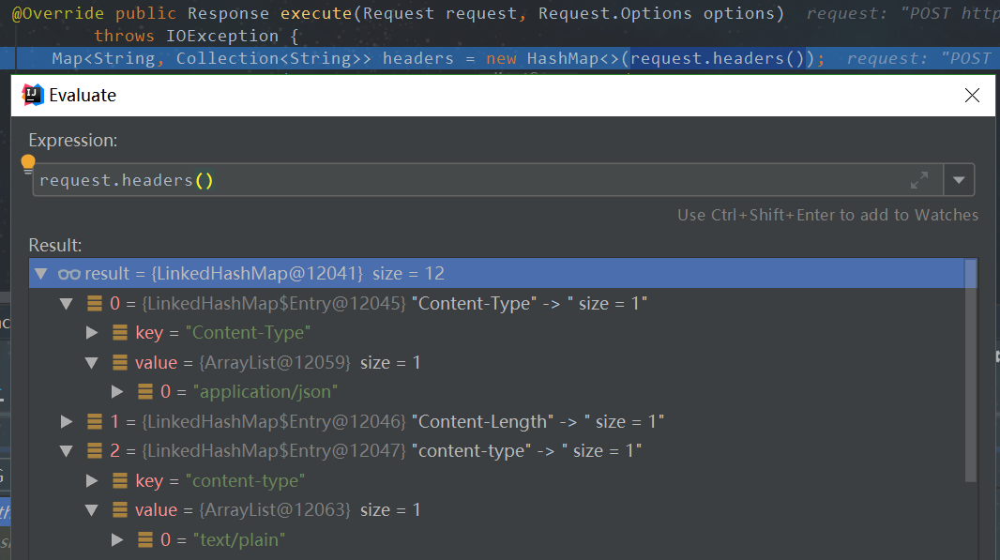
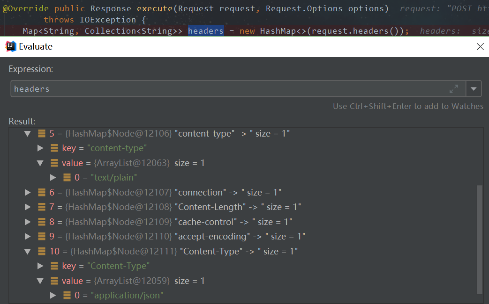
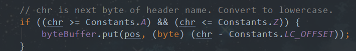

> `SERVICE-A`和`SERVICE-B`两个应用，通过postman发起`Content-Type : text/plain`的请求到`SERVICE-A`,`SERVICE-B`通过FeignClient请求`SERVICE-B`,`SERVICE-B`消费`Content-Type : application/json`请求，当没加入Sleuth依赖时，处理成功，而当加入Sleuth依赖时，抛出`HttpMediaTypeNotSupportedException(Content type 'text/plain;charset=UTF-8' not supported)`异常

## 示例

`SERVICE-A`

```java
@PostMapping("/a/feign")
public Map feign(@RequestHeader("Content-Type") String contentType) {
    Map<String, Object> map = new HashMap<>();
    map.put("original-content-type", contentType);
    return feignClient.helloWorld(map);
}
```

```java
@FeignClient("sleuth-feign-demo")
public interface MyFeignClient {

    @PostMapping("/b/feign")
    Map helloWorld(@RequestBody Map<String, Object> map);
}
```

`SERVICE-B`

```java
@PostMapping("/b/feign")
public Map hello(@RequestBody Map<String,Object> map){
    Map<String, Object> result = new HashMap<>(map);
    result.put("service","Service-B");
    return result;
}
```

## 分析

断点发现`org.springframework.cloud.sleuth.instrument.web.client.feign.TracingFeignClient#execute`方法在增加request追踪请求头时把原请求头保存在HashMap中(原本是保存在LinkedHashMap)。


处理前：`Content-Type`->`content-type`




处理后：`content-type`->`Content-Type`




`feign.Client.Default#convertAndSend`构建connection时，依次把请求头放入`java.net.URLConnection#requests`中

```java
HttpURLConnection convertAndSend(Request request, Options options) throws IOException {
  final HttpURLConnection
      connection =
      (HttpURLConnection) new URL(request.url()).openConnection();
  ...
  boolean hasAcceptHeader = false;
  Integer contentLength = null;
  for (String field : request.headers().keySet()) {
    if (field.equalsIgnoreCase("Accept")) {
      hasAcceptHeader = true;
    }
    for (String value : request.headers().get(field)) {
      if (field.equals(CONTENT_LENGTH)) {
        if (!gzipEncodedRequest && !deflateEncodedRequest) {
          contentLength = Integer.valueOf(value);
          connection.addRequestProperty(field, value);
        }
      } else {
        connection.addRequestProperty(field, value);
      }
    }
  }
  ...
  return connection;
}
```


---

> tomcat 会将所有外部headers名称转为小写 (`org.apache.coyote.http11.Http11InputBuffer#parseHeader`) ，并按传递顺序读取




在 `SERVICE-B`  断点获取并输出`byteBuffer`字节内容

```
POST /b/feign HTTP/1.1
cookie:JSESSIONID=3906BF2566C38C1F437285F54655AF611
postman-token:7efc884b-0fc2-44d8-9661-222c1304c0e33
x-b3-parentspanid:556379ed1ff919899
accept:*/**
x-b3-spanid:b13cdc4dc11548bdd
x-b3-sampled:11
content-type:text/plainn
x-b3-traceid:556379ed1ff919899
cache-control:no-cachee
accept-encoding:gzip, deflatee
content-type:application/jsonn
user-agent:PostmanRuntime/7.13.00
host:192.168.103.172:180022
connection:keep-alivee
content-length:388

{"original-content-type":"text/plain"} 
```


`SERVICE-B`在解析请求参数时会调用到以下的`readWithMessageConverters(...)`方法,该方法会通过获取请求头`Content-Type`,并判断`HttpMessageConverter`是否支持读取该类型，如果`List<HttpMessageConverter<?>> messageConverters`都不支持，则会导致`HttpMediaTypeNotSupportedException`异常。

`org.springframework.web.servlet.mvc.method.annotation.AbstractMessageConverterMethodArgumentResolver#readWithMessageConverters(org.springframework.http.HttpInputMessage, org.springframework.core.MethodParameter, java.lang.reflect.Type)`

```java
protected <T> Object readWithMessageConverters(HttpInputMessage inputMessage, MethodParameter parameter,
      Type targetType) throws IOException, HttpMediaTypeNotSupportedException, HttpMessageNotReadableException {

   MediaType contentType;
   boolean noContentType = false;
   try {
       //获取Content-Type的值，在本例中将取到值[text/plain]
		contentType = inputMessage.getHeaders().getContentType();
   }
   catch (InvalidMediaTypeException ex) {
   	throw new HttpMediaTypeNotSupportedException(ex.getMessage());
   }
   ...
}
```


`org.springframework.http.server.ServletServerHttpRequest#getHeaders`

```java
	public HttpHeaders getHeaders() {
		if (this.headers == null) {
			this.headers = new HttpHeaders();

			for (Enumeration<?> names = this.servletRequest.getHeaderNames(); names.hasMoreElements();) {
				String headerName = (String) names.nextElement();
				for (Enumeration<?> headerValues = this.servletRequest.getHeaders(headerName);
						headerValues.hasMoreElements();) {
					String headerValue = (String) headerValues.nextElement();
					this.headers.add(headerName, headerValue);
				}
			}

			// HttpServletRequest exposes some headers as properties:
			// we should include those if not already present
			try {
				MediaType contentType = this.headers.getContentType();
				if (contentType == null) {
					String requestContentType = this.servletRequest.getContentType();
					if (StringUtils.hasLength(requestContentType)) {
						contentType = MediaType.parseMediaType(requestContentType);
						this.headers.setContentType(contentType);
					}
				}
				if (contentType != null && contentType.getCharset() == null) {
					String requestEncoding = this.servletRequest.getCharacterEncoding();
					if (StringUtils.hasLength(requestEncoding)) {
						Charset charSet = Charset.forName(requestEncoding);
						Map<String, String> params = new LinkedCaseInsensitiveMap<>();
						params.putAll(contentType.getParameters());
						params.put("charset", charSet.toString());
						MediaType mediaType = new MediaType(contentType.getType(), contentType.getSubtype(), params);
						this.headers.setContentType(mediaType);
					}
				}
			}
			...
		}

		return this.headers;
	}
```

`org.springframework.http.HttpHeaders#getContentType`

```java
public MediaType getContentType() {
   String value = getFirst(CONTENT_TYPE);
   return (StringUtils.hasLength(value) ? MediaType.parseMediaType(value) : null);
}
```

`org.springframework.http.HttpHeaders#getFirst`

```java
public String getFirst(String headerName) {
   List<String> headerValues = this.headers.get(headerName);
   return (headerValues != null ? headerValues.get(0) : null);
}
```


究其根由，是由于Sleuth在`org.springframework.cloud.sleuth.instrument.web.client.feign.TracingFeignClient#execute`处理headers时，将原来的headers保存到了`HashMap`中，导致请求头顺序被打乱，从而出现异常。